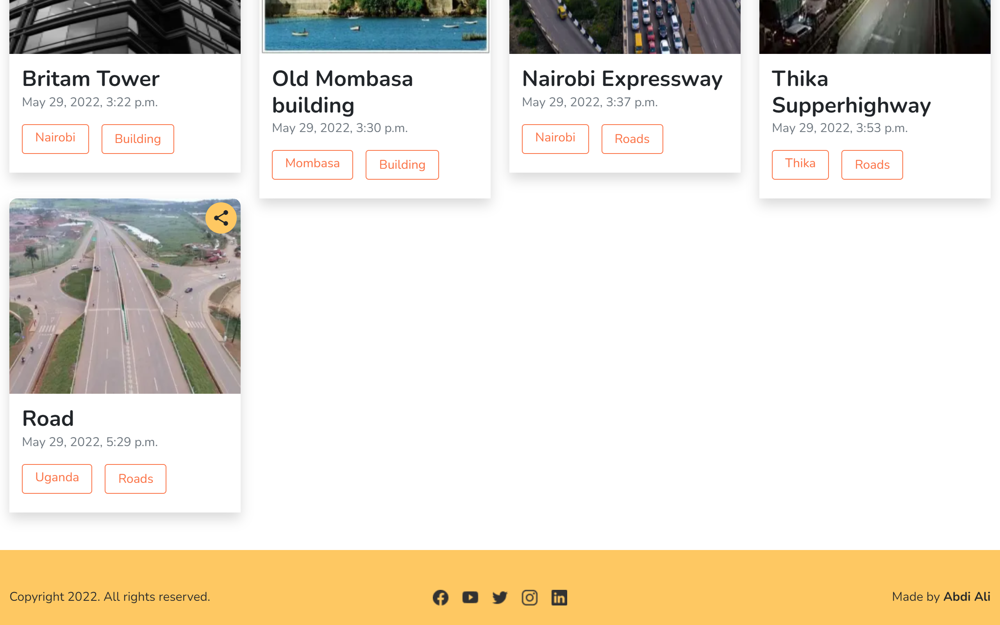

# Photo-Gallery

## Author

[Abdi-Ali](https://github.com/Abdi-Ali33)

# Description
A personal gallery application that I display my photos for others to see.

## Screenshot




# Setup / Installation
* clone the repo:

```shell
git clone` https://github.com/Abdi-Ali33/Photo-Gallery.git`
```

```
cd Photo-Gallery
```
* create virtual environment 

```shell
python -m venv virtual
```

* To activate the virtual environment
```shell
 venv/scripts/activate
```

* install the packages from requirements.txt
```shell
pip install -r requirements.txt 
```

* setup environment variables
```shell
cp .env.example .env
```
* Execute the shell script and start the server
```shell
python manage.py runserver
```
* open the browser and navigate to http://127.0.0.1:8000/ to see the application in action
## Technologies Used
The following technologies have been used on this project:

* HTML
* CSS
* JS
* Bootstrap
* Django
* Python
* Cloudinary (for image upload)

## User Story  
  
* View different photos that interest them  
* Click a single image to expand it and view the details of that photo  
* Search for different categories   
* Copy a link to the photo to share with my friends.  
* View photos based on the location they were taken.  